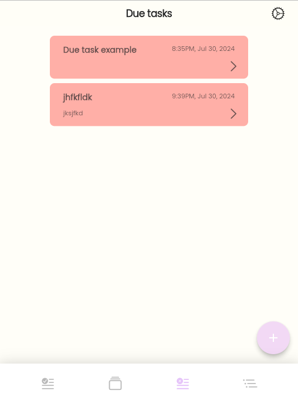

# todolist

A Flutter project to manage your daily tasks.

## Description

This project is a simple todo list app that allows you to add, edit, and delete tasks. It also allows you to mark tasks as completed.
There are main points in the bottom navigation bar to view tasks that:
- are due today
- are overdue
- task board (sections and tasks within sections)
- are completed (history)

A task can be created using a floating button.
There are also settings, currently providing the only one option to create a section.
Task can be viewed and commented with text messages.

## Screenshots

### Note
The app has demo purposes, so the token is set using app config, auth is not available and not implemented.